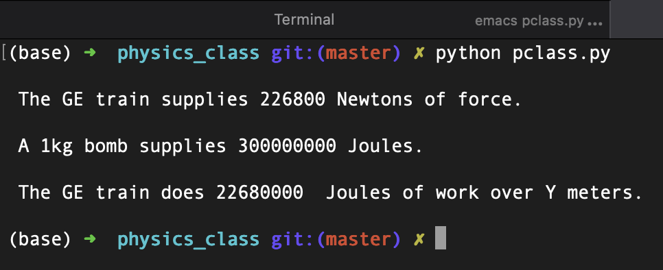

# Getting Ready for Physics Class

### What does it do ?
> A bit of physics (no user input).

### How does it looks ?
> 

### How do i use it ?
> simply run the Python program.

### How was it done ?
> Using the CLI, Emacs, and Python code.

### Why ?
> Codecademy Python project.